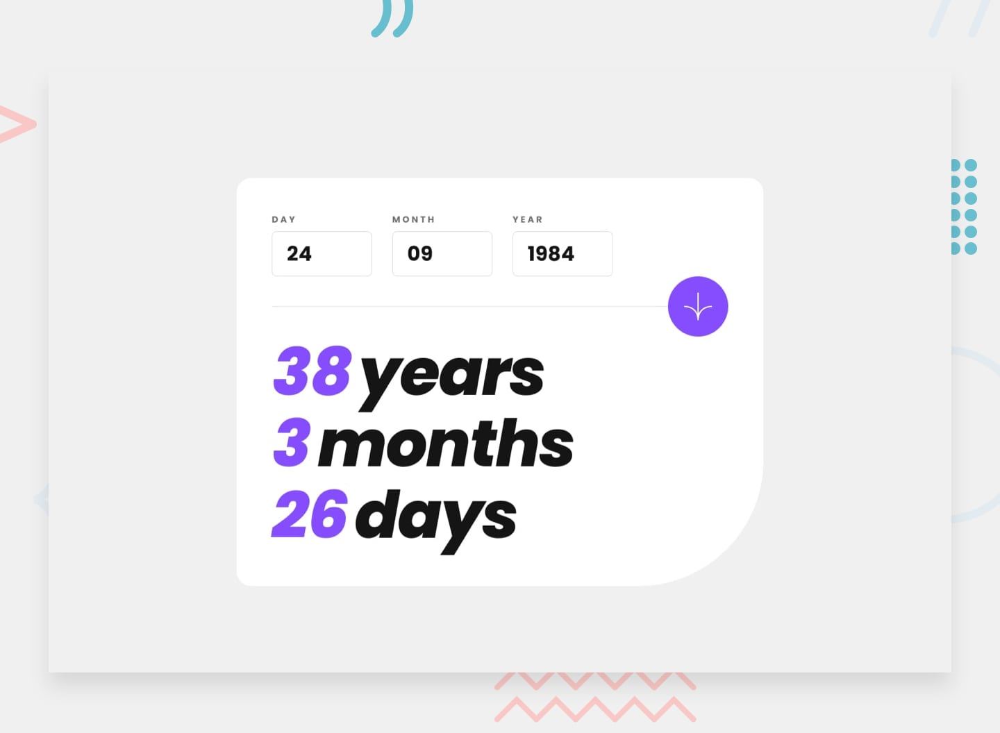

<h1 align="center">
   <p>Age calculator app</p>
</h1>



<p align="center">
 <a href="#tecnologias">Tecnologias</a> •
 <a href="#layout">Layout</a> • 
 <a href="#pre-requisitos">Pré-requisitos</a> • 
 <a href="#-guia-de-estilo">Guia de estilo</a> • 
 <a href="#tecnologias">Tecnologias</a> • 
 <a href="#-autora">Autora</a>
</p>

<h4 align="center"> 
	🎉 Sidebar - Concluído  🎉
</h4>

## Sobre

Aplicação calculadora de idade, desenvolvido para aprimorar habilidades em javascript e validação de formulários do <a href="https://www.frontendmentor.io/challenges/age-calculator-app-dF9DFFpj-Q" target="_blank">Frontend Mentor.</a>

## Carcterísticas

Os usuários devem ser capazes de:

- Visualizar uma idade em anos, meses e dias após enviar uma data válida por meio do formulário
- Receber erros de validação se:
  - Qualquer campo está vazio quando o formulário é enviado
  - O número do dia não está entre 1-31
  - O número do mês não está entre 1-12
  - O ano está no futuro
  - A data é inválida, por ex. 31/04/1991 (abril tem 30 dias)
- Veja os estados de focalização e foco para todos os elementos interativos na página

## Tecnologias

As seguintes ferramentas foram usadas na construção do projeto:

- [HTML](https://www.w3schools.com/html/)
- [CSS](https://www.w3schools.com/css/)
- [Javascript](https://www.w3schools.com/js/js_intro.asp/)

## 🎨 Guia de estilo

### Cores:

```css
:root {
  --Purple: hsl(259, 100%, 65%);
  --Light-red: hsl(0, 100%, 67%);
  --White: hsl(0, 0%, 100%);
  --Off-white: hsl(0, 0%, 94%);
  --Light-grey: hsl(0, 0%, 86%);
  --Smokey-grey: hsl(0, 1%, 44%);
  --Off-black: hsl(0, 0%, 8%);
}
```

### Tipo de Fonte:

- Font-family: Poppins

- Font-weight: 400 e 700

<a href="https://www.figma.com/file/EYimYoWWhNVjDZdc0zv1Vw/DD-Portfolio-Copy?fuid=1100112420700070907">
  
</a>

## 🦸 Autora

<a href="https://www.linkedin.com/in/tayanna-amorim-98161623b/">
 
 <br />
 <sub><b>Tayanna Amorim</b></sub></a> <a href="https://www.linkedin.com/in/tayanna-amorim-98161623b/" title="tayanna"></a>
 <br />
<br />

[](https://www.linkedin.com/in/tayanna-amorim-98161623b/)
[](mailto:amorim.tayanna@gmail.com)
